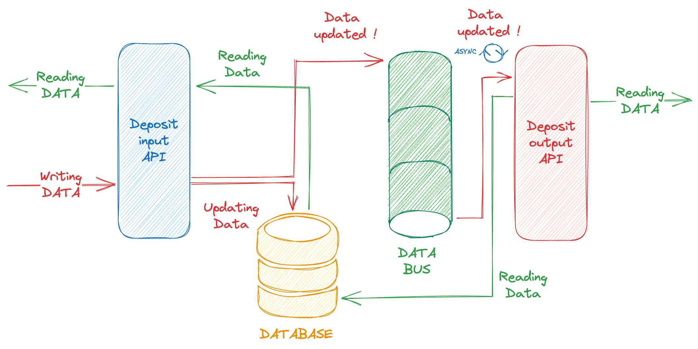

# Load Test With Taurus Demo

To use Taurus against an application for the demonstration, I made
Deposit app in python with falcon with pypy3, that should run pretty well
according to falcon framework community.

For more information about falcon framework [see this link](https://falconframework.org)

## What this API does ?

This api is used as a data deposit between two contexts

The first context (on the left) serves an amount of data on based on identifier. (Like product, data chunk, etc...)
The second context (on the right) is consuming data as listener.

When data are updated in the deposit:
1. The input API (blue part of the schema) receives an amount of data
2. Data are created or updated in database.
3. Events are sent (for each independent id) to the bus to mark ids as updated.
4. The output API (red part of the schema) is listening to the command events in the data bus.
5. The data is read in the database to retrieve the data.

The data bus is working as a command pattern.

Note: The emitted data to the deposit is always "fresh" on the input endpoint, meanwhile, when the output endpoint 
consumes the data, the data might have changed since the emission. This is why a command pattern is chosen in the 
management of the bus.

